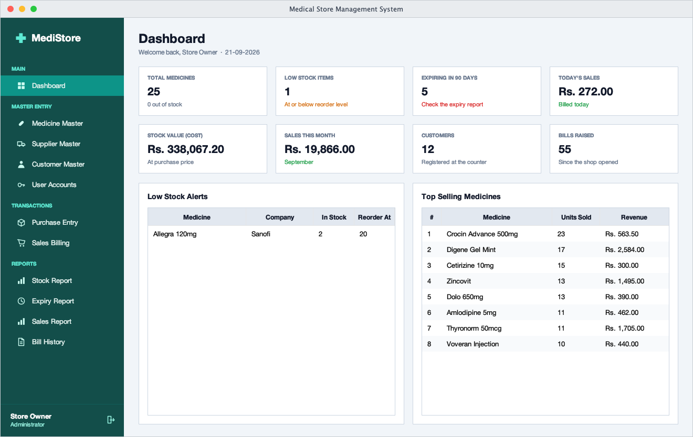
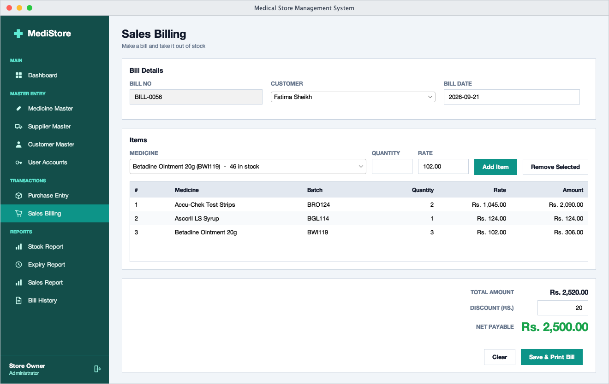
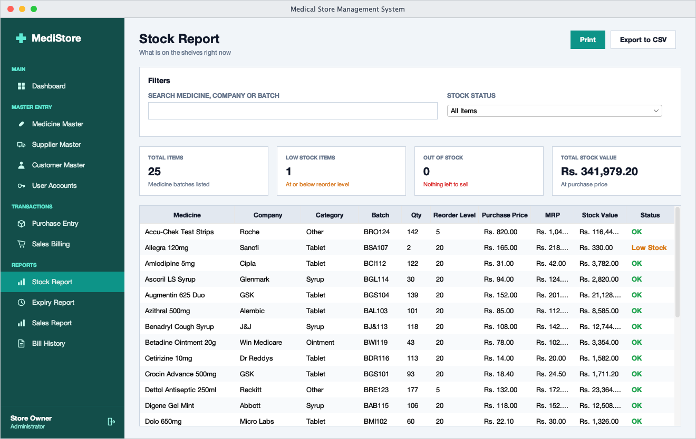
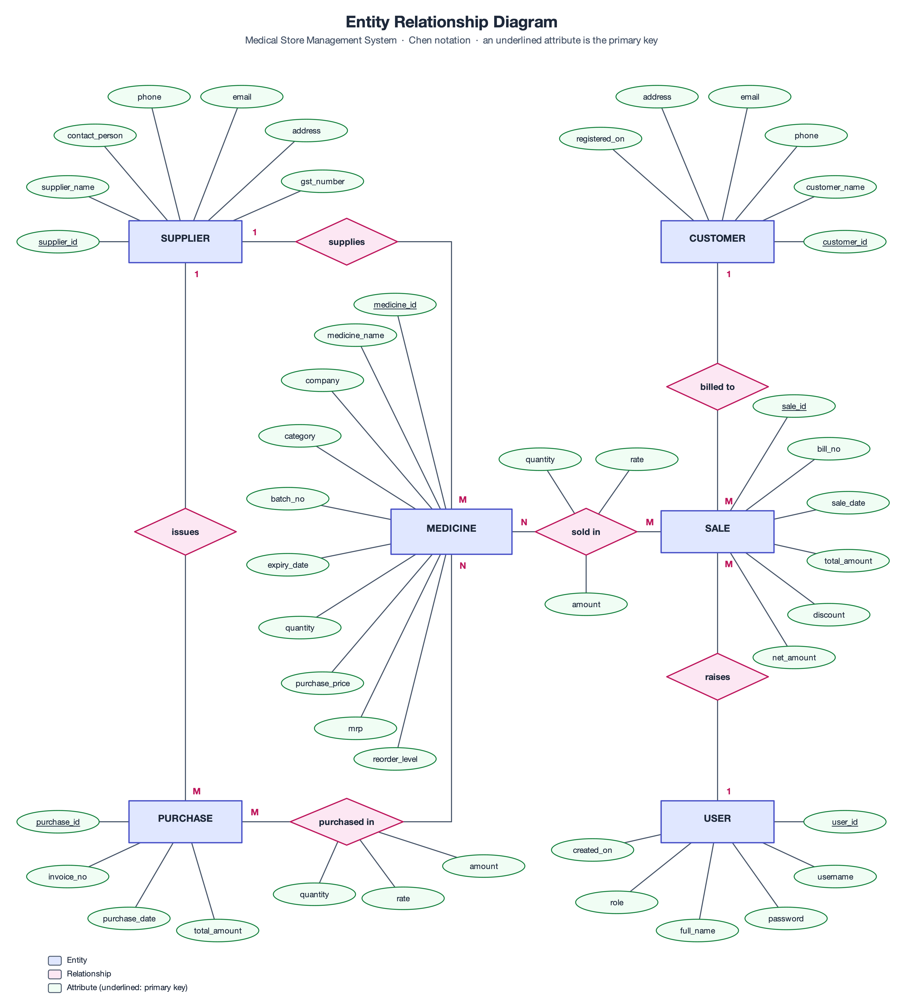

# MediStore

A desktop Medical Store Management System built with **Java 21**, **Swing** and **SQLite**. It replaces the paper purchase register, stock register and bill book of a small pharmacy with one portable application: no server, no installer and no internet connection required.

This was built solo as a final-year college project for **B.Com (Computer Application)**, Semester V, at D. R. Kakade College of Commerce, Savitribai Phule Pune University (SPPU), in September 2026.

## What it does

A pharmacist or counter staff member signs in, records stock received from suppliers, bills customers at the counter, and always knows what is on the shelf, what is about to expire and what has sold. Stock is never adjusted by hand and never drifts from the books, because every purchase and every sale changes the stock inside the same database transaction that saves the document.

## Features

- **Role-based login** with three roles (Administrator, Pharmacist, Counter Staff). Each role sees only the menu entries it is allowed to open.
- **Dashboard** with eight live figures (medicines, low stock, expiring batches, today's sales, stock value, month's sales, customers, bills), a low-stock list and a top-sellers list.
- **Four master screens** for medicines, suppliers, customers and user accounts, each with add, update, delete and search-as-you-type. Deleting a medicine, supplier or customer is refused while other records still depend on it.
- **Purchase entry and sales billing in one database transaction.** Saving an invoice or a bill writes the header, its lines and the stock change together. If any step fails, the whole transaction is rolled back, so the stock can never disagree with the documents that produced it.
- **Overselling and expiry blocking.** The billing screen offers only medicines that are in stock, refuses a line that would exceed the units on hand, and will neither offer nor sell a batch that has passed its printed expiry date.
- **Low-stock and expiry alerts** on the dashboard and in the Expiry Report (already expired, or expiring within 30, 90 or 180 days).
- **Four reports** (Stock, Expiry, Sales, Bill History), each printable through the standard print dialog and exportable to CSV.
- **SHA-256 password hashing.** Passwords are never stored or displayed as plain text.

## Tech stack

| Item | Choice |
|---|---|
| Language | Java 21 (JDK 21 LTS) |
| GUI | Java Swing with the FlatLaf look-and-feel |
| Database | SQLite through the sqlite-jdbc driver |
| Logging | SLF4J API with a no-operation binding (needed by the SQLite driver) |
| Build | Plain `javac` driven by shell scripts; no Maven or Gradle |

## Package layout

```
src/medistore/
├── db/      Database opens the SQLite file; Schema holds the eight CREATE TABLE statements
├── model/   Plain data classes: Medicine, Supplier, Customer, User, Purchase, Sale, ...
├── dao/     All SQL lives here: one data-access class per record type, plus ReportDao
├── ui/      MainFrame, LoginForm, DashboardForm, BaseForm, and the master / transaction / report screens
├── util/    Shared styling (UI), FormGrid layout builder, Validator, Passwords, Session
└── tools/   Development helpers: sample-data generator, diagram generator, screenshot tool, test runner
```

## Build and run

The JDK and the libraries are **not committed**. They belong in a git-ignored `tools/` folder that you create yourself:

- a JDK 21 whose home folder is named `Home` and sits at most three levels below `tools/` (for example the macOS layout `tools/jdk-21.jdk/Contents/Home`), which is how the scripts find it
- `tools/sqlite-jdbc.jar`
- `tools/flatlaf.jar`
- `tools/slf4j-api.jar`
- `tools/slf4j-nop.jar`

Then, from the project folder:

```bash
./build.sh   # compiles every source file into build/classes
./run.sh     # builds if needed, then starts the application
./seed.sh    # rebuilds data/medistore.db with deterministic demonstration data
```

If the scripts are not executable after cloning, run `chmod +x *.sh` once.

The database is one file, `data/medistore.db`, created next to the program on first run together with a default administrator account.

**Demo login:** `admin` / `admin123`. This is the default administrator that is created on first start and in the demonstration data. Change it before any real use.

## Tests

Thirteen test cases (T1 to T13) cover login, input validation, stock movement on purchase and sale, protection against overselling, protected deletion, duplicate user names, discount limits and expiry blocking. They run as an automated check, `medistore.tools.SmokeTest`, against a throwaway database (it refuses to run against the real one), and all thirteen pass. The full list with inputs, expected results and outcomes is in [`docs/report.md`](docs/report.md).

## Screenshots

| Dashboard | Sales Billing |
|---|---|
|  |  |

| Stock Report | Entity Relationship Diagram |
|---|---|
|  |  |

All fifteen screenshots are in [`screenshots/`](screenshots/), and the data flow diagrams, data model and ERD are in [`docs/diagrams/`](docs/diagrams/).

## Project report

[`docs/report.md`](docs/report.md) is the full project report: motivation and scope, requirements, data flow diagrams, data dictionary, ERD, implementation notes, screen-by-screen outputs, test cases, conclusion and future scope.

## Known limitations

Stated in full in the report: one computer and one database file (no server or multi-counter use), no barcode input, no tax computation, one row per medicine batch (no automatic first-expiry-first-out), saved invoices and bills cannot be edited or cancelled, role control applies to the menu rather than to individual actions, and password hashes are unsalted. The receipt heading (shop name and address) is fixed sample text.

## Author

**Manish Mewada**

## License

MIT. See [LICENSE](LICENSE).
